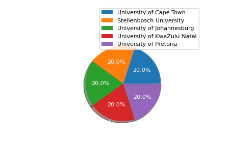
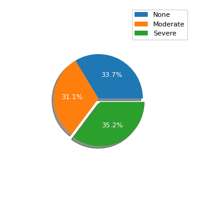
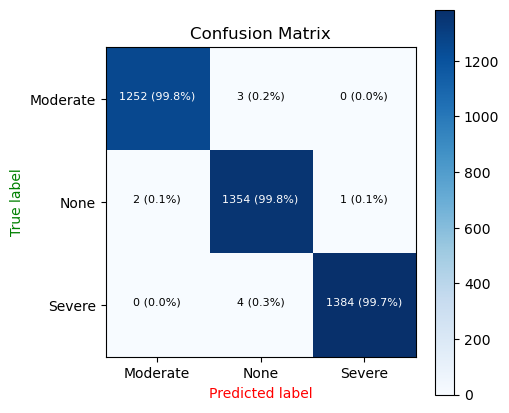

### LoadShedding Impact

In this project we are using both `supervised` and `unsupervised` machine learning algorithm to predict the loadshedding impact of student performance in South African `5` selected universities.

1. `University of Cape Town`
2. `Stellenbosch University`
3. `University of KwaZulu-Natal`
4. `University of Johannesburg`
5. `University of Pretoria`

A sample `4000` students from each university was taken for this survey.

 

The loadshedding impacts are classified in `3` categories which are:

1. `Severe`
2. `Moderate`
3. `None`

Our features and labels distributions are distributed as follows:

 

After the model has been trained the following was the confusion matrix from the `test` dataset.

 

From the above confusion matrix we can be able to see that our model is performing well on the test data in classifying loadshedding impact on student performance although it mis classified some labels:

- 2 labels were classified as having `Moderate` impact while they impact to the student is `None` yielding a percantage of `0.1%` misclassified on the label `None`.
- 3 labels were classified as having `None` impact while they impact to the student is `Moderate` yielding a percantage of `0.2%` misclassified on the label `Moderate`
- 4 labels were classified as having `None` impact while they impact to the student is `Severe` yielding a percantage of `0.3%` misclassified on the label `Severe`.
- 1 label was classified as having `Severe` impact while they impact to the student is `None` yielding a percantage of another `0.1%` misclassified on the label `None`.

> In the test dataset there are only `10` labels that was misclassified by the model.

### Notebooks

There are two notebooks for this task which are:

1. [00_DATA_LABLING](/00_DATA_LABLING.ipynb) - an unsupervised clustering task for relabeling the mislabeled dataset.
2. [01_CLASSIFIER_MODEL](/01_CLASSIFIER_MODEL.ipynb) -a supervised classification model for predicting loadshedding impact on students.

### LICENSE

You can read about the project [LICENSE](/LICENSE).
