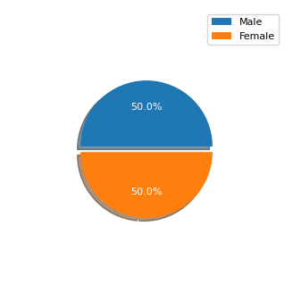
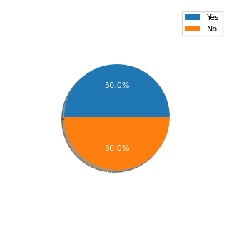
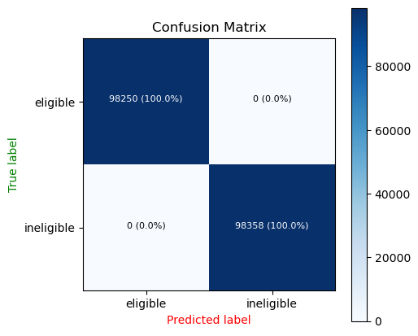

### NSFAS Recommendation System

In this project we are using both `supervised` and `unsupervised` machine learning algorithm to predict weather a student will qualify for funding or not. So basically this is a simple binary classification model using machine learning algorithms.

We are basically going to predict the eligibility of a student to qualify for funding.

### Data

The data that we are working with comes from the folder called `data`, In this folder we have a file called `dataset_combined.xlsx` which contains mislabeled examples and we are going to label the features to the correct label using unsupervised clustering techniques so that. A dataset file called `dataset_combined.csv` will then be saved in the `data` folder. The clusters that we came up with after relabeling are shown in the following plot.

 

The funding schemes that were in these dataset are:

1. `INSPIRE Scholarship 2022-23 ? Scholarship for Higher Education (SHE)`
2. `Abdul Kalam Technology Innovation National Fellowship`
3. `AAI Sports Scholarship Scheme in India 2022-23`
4. `Glow and lovely Career Foundation Scholarship`
5. `National Fellowship for Persons with Disabilities`
6. `ONGC Sports Scholarship Scheme 2022-23`
7. `Pragati Scholarship ? AICTE-Scholarship Scheme to Girl Child`
8. `Dr. Ambedkar post matric Scholarship`
9. `Indira Gandhi Scholarship for Single Girl Child UGC Scholarship for PG Programmes`
10. `National Overseas Scholarship Scheme 2021-22`

The `Education Qualification` was distributed as follows:

 

The `Gender` was distributed as follows:

 

The relationship between the `Community` and `Religion` in the dataset was distributed as follows:

 

The relationship between the people who were disabled and who play sports in the dataset was distributed as follows:

 

The relationship between `Annual-Percentage` and `Income` was distributed a follows:

 

The count of values of `Exservice-man` column yield the following.

 

The count of values of people who were in or out of `India` yield the following.

 

In our dataset we were able to get `50%` and `50%` label distribution.

 

After splitting the examples before model training the following were the counts of examples for each set.

 

After the model has been trained the following was the confusion matrix from the `train` dataset.

 

\
After the model has been trained the following was the confusion matrix from the `test` dataset.

 

From the above confusion matrix we can be able to see that our model is performing well on the test data in classifying eligibility of student to qualify for funding:

From the above confusion matrix we can be able to see that our model is performing well on the test data in classifying eligibility of students to qualify for funding. The summary of the confusion matrix is as follows:

- `~24K` examples were classified as `eligible` and they belong to this class.
- `~24K` examples were classified as `ineligible` and they belong to this class.
- None of these two classes was mispredicted.

### Notebooks

There are two notebooks for this task which are:

1. [00_DATA_LABLING](00_DATA_LABLING.ipynb) - an unsupervised clustering task for relabeling the mislabeled dataset.
2. [01_CLASSIFIER_MODEL](01_NSFAS_RS_MODEL.ipynb) -a supervised classification model for predicting loadshedding impact on students.

### LICENSE

You can read about the project [LICENSE](/LICENSE).
